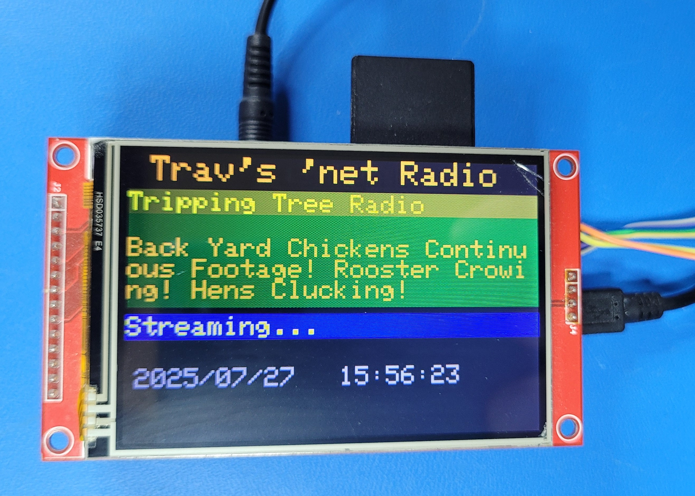

# Internet-Radio
ESP32 based WiFi Internet Radio with display, rotary encoder controls, and SD storage

## Stand-alone version:
|||
|--|--|
|||

## Full version incorporated in a 1941 Philco Radio case:
|||
|--|--|
|<video src="Pictures/1941 Philco/Internet Radio_01.mp4" title="1941 Philco project"></video>||

## Features
* Plays streaming MP3 stations
  * Large buffer for smooth playback
* Parses/displays displays meta data information
* Stores settings and favorite stations on SD card
* Can display pictures (jpg) and play MP3 files
* Displays time, synched from internet connection
* Remote control interface via TTL serial

## Operation
* "S" Rotary Encoder: Push to enter menu system/select.  Rotate to move "cursor"
* "C" Rotary Encoder: Turn (slowly) to select channels, like a dial.  push to stop streaming.
* Scan for wifi and enter a PW in the menu (among other things, explore away).
  * All the settings are saved to "NetRadio.txt" on the SD card. 

## Inspiration
* https://github.com/Edzelf/Esp-radio
* https://github.com/RalphBacon/205-Internet-Radio

